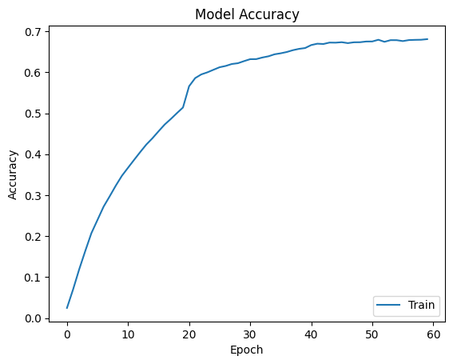

# GoogLeNet Paper Reproduction (2015)

## Introduction
This project reproduces the original GoogLeNet architecture as described in the paper.

## Architecture Summary
| Stage            | Layer / Block | Branch     | Operation                   | Filters / Units | Kernel / Stride | Output Size    |
| ---------------- | ------------- | ---------- | --------------------------- | --------------- | --------------- | -------------- |
| Input            | Input         | –          | Input                       | –               | –               | 224 × 224 × 3  |
| **Stem**         | Conv1         | –          | Conv + BN + ReLU            | 64              | 7×7 / 2         | 112 × 112 × 64 |
|                  | Pool1         | –          | MaxPool                     | –               | 3×3 / 2         | 56 × 56 × 64   |
|                  | Conv2         | –          | Conv + BN + ReLU            | 64              | 1×1 / 1         | 56 × 56 × 64   |
|                  | Conv3         | –          | Conv + BN + ReLU            | 192             | 3×3 / 1         | 56 × 56 × 192  |
|                  | Pool2         | –          | MaxPool                     | –               | 3×3 / 2         | 28 × 28 × 192  |
| **Inception 3a** | Inception     | 1×1        | Conv                        | 64              | 1×1             | 28 × 28 × 64   |
|                  |               | 3×3        | 1×1 → 3×3                   | 96 → 128        | 1×1, 3×3        | 28 × 28 × 128  |
|                  |               | 5×5        | 1×1 → 5×5                   | 16 → 32         | 1×1, 5×5        | 28 × 28 × 32   |
|                  |               | Pool       | 3×3 MaxPool → 1×1           | 32              | 3×3, 1×1        | 28 × 28 × 32   |
|                  |               | **Concat** | –                           | **256**         | –               | 28 × 28 × 256  |
| **Inception 3b** | Inception     | –          | Same structure              | –               | –               | 28 × 28 × 480  |
|                  | Pool3         | –          | MaxPool                     | –               | 3×3 / 2         | 14 × 14 × 480  |
| **Inception 4a** | Inception     | –          | (192, 96→208, 16→48, 64)    | –               | –               | 14 × 14 × 512  |
|                  | Aux-1         | –          | Auxiliary Classifier        | –               | –               | 200            |
| **Inception 4b** | Inception     | –          | (160, 112→224, 24→64, 64)   | –               | –               | 14 × 14 × 512  |
| **Inception 4c** | Inception     | –          | (128, 128→256, 24→64, 64)   | –               | –               | 14 × 14 × 512  |
| **Inception 4d** | Inception     | –          | (112, 144→288, 32→64, 64)   | –               | –               | 14 × 14 × 528  |
|                  | Aux-2         | –          | Auxiliary Classifier        | –               | –               | 200            |
| **Inception 4e** | Inception     | –          | (256, 160→320, 32→128, 128) | –               | –               | 14 × 14 × 832  |
|                  | Pool4         | –          | MaxPool                     | –               | 3×3 / 2         | 7 × 7 × 832    |
| **Inception 5a** | Inception     | –          | (256, 160→320, 32→128, 128) | –               | –               | 7 × 7 × 832    |
| **Inception 5b** | Inception     | –          | (384, 192→384, 48→128, 128) | –               | –               | 7 × 7 × 1024   |
| **Head**         | GAP           | –          | Global Avg Pool             | –               | –               | 1024           |
|                  | Dropout       | –          | Dropout                     | p = 0.4         | –               | 1024           |
|                  | FC            | –          | Dense                       | 200             | –               | 200            |

## Dataset
tiny-imagenet-200 is used as the dataset in this reproduction. Validation set is used as test set, as the actual test set is not labelled. Each image is resized from 64×64 to 256*256 and randomly crop an 224*224 image from it with a 50% chance of horizontal flip.

## Reproduced Results
| Metric            | Value |
| ----------------- | ----- |
| Training accuracy | 67.33% |
| Test accuracy     | 46.01% |

## Discussion
After using cropping and horizontal flipping, we significantly reduce overfitting, compared with the VGGNet we trained earlier.

Auxiliary classifiers aren't used in this reproduction. Instead, we use batchnormalisation to prevent vanishing gradient or exploding gradient. One of the reasons is that auxiliary classifiers add extra parameters and must manually weighted for different training sets. While BN directly stabilises activation distributions without adding too many extra parameters.

From the difference between training set accuracy and test set accuracy, we can still see a significant difference. In the future, we can crop different portion of an image and resize it back to 224 * 224.

## References
Szegedy, C., Liu, W., Jia, Y., Sermanet, P., Reed, S., Anguelov, D., Erhan, D., Vanhoucke, V., & Rabinovich, A. (2015). Going deeper with convolutions. In Proceedings of the IEEE Conference on Computer Vision and Pattern Recognition (CVPR).

Tiny ImageNet dataset — 200-class subset of ImageNet used in CS231n.
Official download (includes training/validation/test):
http://cs231n.stanford.edu/tiny-imagenet-200.zip
